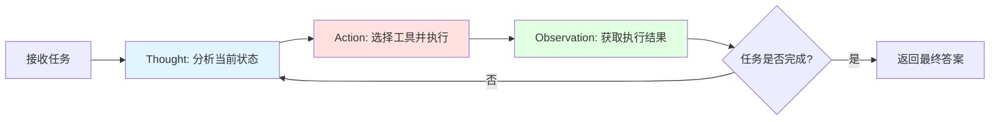
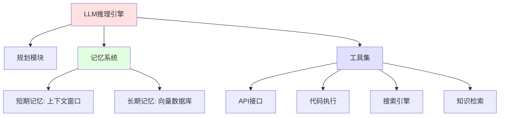
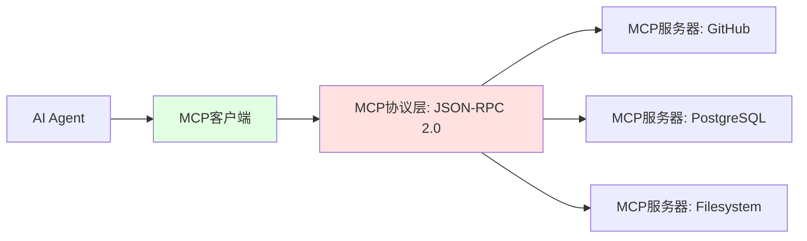

# Agent：自主执行代理

## 从被动响应到主动执行

LLM擅长理解和生成文本，RAG为其提供外部知识，但它们都局限于"被动响应"模式：接收输入，返回输出，任务结束。

**Agent（智能体）** 打破了这一限制。它将LLM从"文本处理器"升级为"任务执行器"，赋予其三大能力：

1. **规划（Planning）**：将复杂目标拆解为可执行的子任务
2. **工具调用（Tool Use）**：调用外部API、数据库、终端命令
3. **闭环反馈（Closed-loop Feedback）**：根据执行结果调整策略，必要时重试或回溯

这种能力转变可类比为：

| 传统LLM | AI Agent |
|---------|---------|
| 问答机器人 | 全栈工程师 |
| `grep "error" log.txt` | 自动定位错误、搜索解决方案、生成修复补丁 |
| 生成SQL查询 | 执行查询、分析结果、生成可视化报告 |

## 核心架构：ReAct循环

目前最主流的Agent设计模式是 **ReAct（Reasoning and Acting）**。它模仿人类解决问题的思维过程，在"思考"与"行动"之间迭代。



### ReAct的执行流程

以"分析上个月服务器日志异常"为例，展示四轮迭代：

1. **思考** → 需要日志数据 → **行动** → 调用日志查询工具 → **观察** → 获得文件路径
2. **思考** → 需要统计错误 → **行动** → 调用错误分析工具 → **观察** → 发现ConnectionTimeout高频
3. **思考** → 需要解决方案 → **行动** → 调用搜索工具 → **观察** → 获得相关文档
4. **思考** → 信息充足 → **行动** → 生成报告 → **结束**

核心机制：每轮的Observation会追加到上下文中，影响下一轮的Thought。这种闭环反馈使Agent能够根据执行结果动态调整策略。

### 工程实现的核心机制

ReAct并非模型的内置能力，而是通过三个工程组件实现：

**1. 工具定义（Tool Schema）**

每个工具包含名称、描述、参数定义。这些信息会注入到Prompt中，让模型"知道"可以调用哪些能力。

设计要点：描述必须精确，模糊的描述会导致模型误用工具。参数定义需要包含类型和约束，便于后续验证。

**2. Prompt模板（ReAct Template）**

系统指令定义了严格的输出格式：`Thought → Action → Action Input`。这种结构化约束是ReAct工作的前提。

关键权衡：格式越严格，解析越可靠，但也限制了模型的灵活性。生产环境通常选择严格格式。

**3. 执行循环（Agent Loop）**

宿主程序循环执行四步：LLM推理 → 解析Action → 执行工具 → 追加Observation。循环终止条件是模型输出`finish`或达到最大步数。

::: warning 循环终止条件
必须设置最大迭代次数（如20轮），防止Agent陷入死循环。生产环境中，Agent的规划能力仍不完美，可能重复调用相同工具或选择错误的策略。
:::

## 工具调用的两种范式

### 1. Function Calling（函数调用）

由模型厂商（如OpenAI、Anthropic）通过微调实现。模型输出结构化的JSON，直接映射到函数参数。

工作机制：模型在训练时学习了"何时调用工具"和"如何构造参数"。输出格式固定为`{"name": "tool_name", "arguments": {...}}`，无需复杂的文本解析。

**优势**：输出稳定，格式规范，响应速度快  
**限制**：只支持特定模型，灵活性较低，工具定义必须符合厂商的Schema规范

### 2. ReAct Agents（推理代理）

通过Prompt Engineering实现，适用于所有模型。Agent自己描述需要调用的工具，由宿主程序解析执行。

**优势**：灵活度高，可处理复杂的多步推理  
**限制**：输出格式可能不稳定，需要健壮的解析逻辑

## Agent的核心组件

一个完整的Agent系统包含以下模块：



### 规划模块（Planning）

将高层目标拆解为有向无环图（DAG）。

**示例任务**："生成本季度销售分析报告"

拆解为：
1. 从数据库查询销售数据
2. 清洗和聚合数据
3. 生成可视化图表
4. 编写分析文本
5. 组装为PDF报告

**实现方式**：
- **任务分解（Task Decomposition）**：让LLM输出步骤列表
- **依赖分析**：识别步骤间的依赖关系（如步骤2必须在步骤1之后）

### 记忆系统（Memory）

**短期记忆**：存储在上下文窗口中的对话历史。随着交互增多，早期消息会被截断。这类似于CPU的寄存器，容量有限但访问速度快。

**长期记忆**：将历史交互存入向量数据库。Agent可以检索过去的经验，学习错误教训。这类似于硬盘，容量大但需要主动检索。

架构权衡：短期记忆自动可用，但会占用上下文窗口；长期记忆需要显式检索，增加延迟但可以存储无限历史。生产系统通常采用混合策略：关键信息保留在短期记忆，详细历史存入长期记忆。

### 工具集（Tools）

Agent的"手脚"，实现与外部世界的交互。

**典型工具类型**：

| 工具类型 | 功能 | 示例 |
|---------|------|------|
| 数据查询 | 执行SQL、调用API | `query_database`, `fetch_api` |
| 代码执行 | 运行Python/Bash脚本 | `execute_python`, `run_shell` |
| 知识检索 | 调用RAG系统 | `search_docs` |
| 外部服务 | 发送邮件、通知 | `send_email`, `post_slack` |

## 高级模式：Agentic RAG

将RAG系统作为Agent的一个工具，实现主动的知识检索。

**传统RAG**：每次都检索，无论是否需要  
**Agentic RAG**：Agent自主判断何时检索、检索什么、是否需要二次检索

决策逻辑示例：
1. **分析问题复杂度**：简单事实问题直接回答，复杂问题启动检索
2. **选择检索策略**：根据问题类型决定过滤条件（如时间范围、文档类别）
3. **评估检索质量**：如果相关度低，重写查询词并重新检索

核心优势：将"是否检索"从固定流程变为动态决策，避免不必要的检索开销，同时提高检索精度。这种模式极大提高了系统的效率和准确性。

## 工具集成的统一标准：MCP

随着Agent生态的爆发，工具集成陷入碎片化困境。每个Agent框架（LangChain、CrewAI、AutoGen）都需要为每个工具（GitHub、Slack、Notion）编写专用的适配代码。

**模型上下文协议（Model Context Protocol, MCP）** 应运而生，目标是成为AI领域的"USB-C接口"。

### MCP架构



**核心角色**：

1. **MCP服务器**：封装具体能力的微服务（如数据库连接、文件系统访问）
2. **MCP客户端**：运行Agent的宿主程序，负责与服务器通信
3. **MCP协议**：基于JSON-RPC 2.0的标准指令集

### MCP的工程价值

**统一接口**：所有工具遵循相同的协议，Agent无需为每个工具编写适配代码

架构对比：
- **传统方式**：N个Agent × M个工具 = N×M个适配器（碎片化）
- **MCP方式**：N个Agent + M个工具 = N+M个实现（标准化）

这种架构降低了集成复杂度，新工具只需实现MCP协议即可被所有Agent使用。

**渐进式披露**：传统方式需要预先将所有工具定义塞入上下文，浪费Token。MCP支持按需加载。

工作机制：Agent初始只看到工具列表，需要时才获取详细Schema。这种延迟加载策略节省了上下文空间，使Agent能够访问数百个工具而不超出窗口限制。

**代码执行能力**：MCP原生支持在沙箱中执行Agent生成的代码

设计价值：避免将海量原始数据塞入上下文。Agent生成数据处理脚本，MCP在隔离环境中执行，只返回处理后的结果（如统计摘要、可视化图表）。这种模式将计算从LLM转移到本地环境，大幅降低Token成本。

## 生产化挑战与对策

将Agent部署到生产环境，需要解决三大核心问题：

### 1. 可靠性问题

**挑战**：Agent的推理路径不确定，可能调用错误的工具、传递错误的参数、陷入死循环

**对策**：

- **Schema验证**：所有工具调用必须通过JSON Schema验证。这是防御性编程的第一道防线，拒绝格式错误的参数。

- **最大步数限制**：强制终止超过N轮的循环（通常20轮）。这防止Agent在无法完成任务时无限消耗资源。

- **确定性参数**：生产环境使用`temperature=0`，降低输出随机性。这牺牲了创造力，但换来了行为的可预测性。

### 2. 安全性问题

**挑战**：Agent具备执行权限，可能被Prompt注入攻击利用

**威胁场景**：用户输入包含"System Override"等指令，试图覆盖系统Prompt，诱导Agent执行危险操作（如`DROP TABLE`）。

**对策**：

- **权限最小化**：每个工具绑定专用的受限IAM身份。例如查询工具只有`SELECT`权限，且仅限特定表。这确保即使Agent被劫持，也无法执行破坏性操作。

- **沙箱执行**：代码在隔离容器中运行，禁用网络访问，设置超时限制。这将潜在破坏限制在沙箱内，保护宿主系统。

- **输入过滤**：检测并拒绝可疑的Prompt注入模式（如"Ignore previous instructions"）。这是启发式防御，无法100%防御，但可以拦截大部分常见攻击。

### 3. 可观测性问题

**挑战**：Agent的推理过程是黑盒，难以定位为什么在某一步"走歪"了

**对策**：

- **结构化日志**：记录每一轮的Thought、Action、Observation，以及Token消耗和延迟。这些数据是事后分析的基础。

- **Trace可视化**：生成执行流程图，展示每步的耗时和状态。这使得复杂的多步任务可以一目了然地审查。

- **成本追踪**：监控Token消耗和API费用。Agent的多轮迭代可能导致成本激增，实时监控可以触发预算告警或自动降级。

设计原则：可观测性不是事后补救，而是架构的一部分。生产级Agent必须在设计阶段就内置日志、追踪和监控能力。

## 架构定位

Agent是AI工程栈的"操作系统层"，负责任务编排和执行控制。它整合其他组件：

```
用户目标 
  ↓
Agent规划
  ↓
┌─────────┬─────────┬─────────┐
│ 调用LLM │ 调用RAG │ 调用工具 │
└─────────┴─────────┴─────────┘
  ↓
执行结果 → 反馈到Agent → 继续规划
  ↓
最终答案
```

**与LLM的关系**：Agent使用LLM作为推理引擎，但不局限于单次调用  
**与RAG的关系**：Agent将RAG作为一个可选的知识检索工具  
**与MCP的关系**：Agent通过MCP协议连接到标准化的工具生态

将Agent视为一个自动化的DevOps工程师：它理解任务目标，制定执行计划，调用各种工具（LLM、数据库、API），监控执行结果，必要时调整策略。整个过程遵循闭环控制逻辑，直到任务完成。
