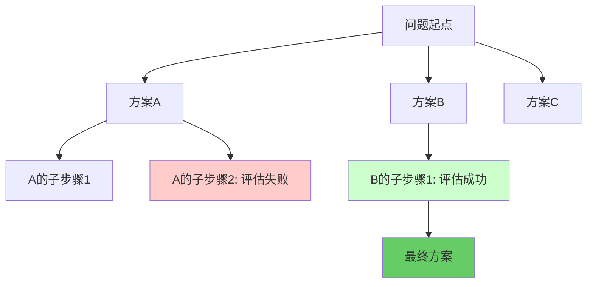

# LLM：概率推理引擎

## 从确定性到概率性的跨越

传统软件架构建立在确定性基础上：相同的输入必然产生相同的输出。数据库查询遵循SQL语义，HTTP请求响应遵循RFC规范，函数调用的返回值可以精确预测。

LLM打破了这一铁律。它将计算从逻辑分支转向统计推断，从指令执行转向模式匹配。这不是技术路线的微调，而是计算范式的切换。

## 本质机制：下一个Token的预测器

LLM的核心操作极其简洁：接收一个文本序列，输出下一个Token的概率分布。

所谓Token，并非完整单词，而是由分词器切分后的最小语义单元。例如`"university"`被拆解为`["uni", "vers", "ity"]`三个Token。模型接收这些Token序列后，在高维向量空间中计算各候选Token的条件概率，选择概率最高的输出。

这一机制决定了LLM的所有能力——代码生成、逻辑推理、文本翻译——本质上都是在万亿参数构成的概率空间中寻找最符合统计规律的路径。

::: tip 工程师类比
将LLM视为一个支持自然语言调用的API端点。输入是Prompt字符串，输出是概率采样后的文本序列。但与REST API不同，相同的请求可能返回不同的响应，因为采样过程引入了随机性。
:::

## 工程接口定义

从API设计的角度，LLM可以抽象为如下函数签名：

```python
def llm_predict(
    prompt: str,
    temperature: float = 0.7,
    max_tokens: int = 2048
) -> str:
    """
    prompt: 输入的上下文序列
    temperature: 采样随机性 [0.0-2.0]
                 0.0 = 确定性最大化，适合逻辑推理
                 1.0 = 平衡创造力与准确性
                 2.0 = 高度发散，适合创意生成
    max_tokens: 生成序列的最大长度
    """
    pass
```

### 核心参数的工程含义

**Context Window（上下文窗口）**

这是LLM的"工作内存"。早期GPT-3仅支持4K Token，现代模型已扩展至256K甚至更长。所有的历史对话、系统指令、参考资料都必须装入这个窗口。一旦超出限制，早期的上下文会被截断，模型陷入"失忆"。

从成本角度看，上下文窗口的使用遵循线性定价模型：Token数量直接决定API调用费用。优化上下文长度是生产环境的关键指标。

**Prompt Engineering（提示工程）**

这不是玄学，而是用自然语言编写指令集。Prompt的结构会直接影响模型在向量空间中的推理路径。

推荐的Prompt架构遵循三段式：

```markdown
# System: 定义硬性约束和角色设定
你是一个资深后端架构师，精通分布式系统设计。
输出必须遵循JSON Schema规范，禁止虚构API。

# Context: 提供背景信息和参考资料
项目当前使用 PostgreSQL + Redis，日均QPS 10万。

# Task: 明确任务目标和输出格式
设计一套缓存预热策略，输出实现步骤和关键代码片段。
```

这种结构的工程价值在于：先定义规则可以剪除不需要的推理分支；设定角色缩小模型的"搜索空间"；明确任务确保输出的可操作性。

**无状态性与会话管理**

LLM本身不存储任何历史状态。每次API调用都是独立的无状态事务。要实现多轮对话，需要手动维护消息列表，并在每次请求时全量传递：

```python
conversation_history = [
    {"role": "system", "content": "你是Python专家"},
    {"role": "user", "content": "如何实现单例模式？"},
    {"role": "assistant", "content": "..."},
    {"role": "user", "content": "这种模式线程安全吗？"}  # 新请求
]

response = llm_predict(conversation_history)
```

这种设计类似于HTTP的无状态特性，将状态管理的责任转移到客户端。

## 推理能力的工程实现

虽然LLM本质是统计模式匹配，但通过架构设计可以模拟出"推理"能力。

### Chain-of-Thought（思维链）

强制模型输出中间步骤，将隐式推理显式化。对比：

**直接推理（易出错）**：
```
Q: 咖啡店有23杯咖啡，卖出17杯，又制作了8杯，现在有多少杯？
A: 14杯
```

**思维链推理（准确率提升）**：
```
Q: 咖啡店有23杯咖啡，卖出17杯，又制作了8杯，现在有多少杯？
A: 让我们逐步计算：
   1. 初始库存：23杯
   2. 卖出后：23 - 17 = 6杯
   3. 制作后：6 + 8 = 14杯
   答案：14杯
```

在Prompt中添加`"让我们逐步思考"`（Let's think step by step）即可激活这一模式。原理是强制模型在输出最终答案前先生成推理路径Token，这些中间Token会影响后续概率分布，从而提高准确性。

### Tree-of-Thought（思维树）

将线性推理扩展为树状探索。模型在每个决策点生成多个候选路径，评估中间状态，必要时回溯。适用于数独求解、代码调试等需要试错的场景。



## 能力边界与工程约束

LLM存在三个核心限制：

1. **幻觉（Hallucination）**：模型会自信地生成符合统计规律但事实错误的内容。这是有损压缩的必然代价。
2. **知识截止日期**：训练数据存在时间边界，模型无法感知训练后发生的事件。
3. **计算成本**：每次推理需要在万亿参数中执行矩阵乘法，延迟和费用都远高于传统API。

工程应对策略：

| 问题 | 解决方案 |
|------|---------|
| 幻觉 | 通过RAG动态注入事实信息，或使用温度=0降低随机性 |
| 知识过时 | 集成实时检索系统，或定期更新知识库 |
| 计算成本 | 缓存常见请求，使用较小模型处理简单任务 |

## 架构定位

在AI工程栈中，LLM扮演"推理引擎"角色，负责理解意图、生成文本、做出决策。但它需要与其他组件配合：

- **RAG（检索增强生成）**：为LLM提供事实依据，降低幻觉风险
- **Agent（智能体）**：调用LLM进行规划，并执行具体操作
- **MCP（模型上下文协议）**：标准化LLM与外部工具的交互接口

将LLM视为分布式系统中的一个微服务：它处理自然语言理解的核心逻辑，但数据持久化、任务编排、安全控制仍需传统工程手段实现。
