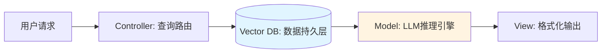
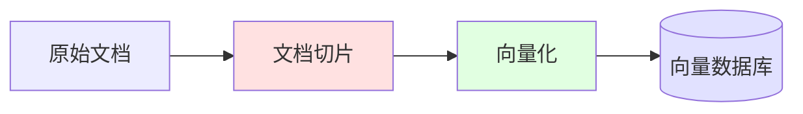
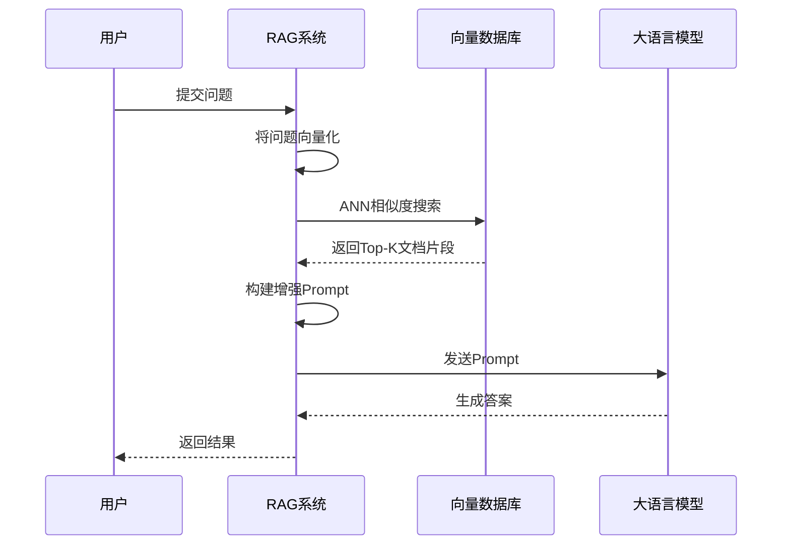
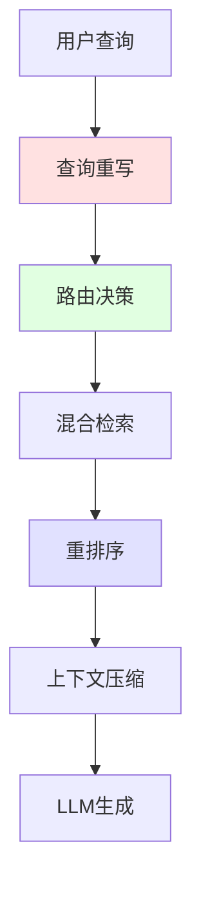

# RAG：检索增强生成

## 问题场景：LLM的知识盲区

LLM面临两个结构性缺陷：

1. **知识截止日期**：训练数据存在时间边界。模型无法感知最新的API文档、今天的股价、昨天的新闻。
2. **私有数据盲点**：模型从未见过企业内部的代码库、设计文档、运维日志。

这两个问题导致实际应用中频繁出现"一本正经地胡说八道"（幻觉）。让模型解释公司内部的微服务架构，它会基于统计规律虚构出看似合理的答案。

**RAG（Retrieval-Augmented Generation）** 通过在推理前动态注入外部知识，将"闭卷考试"转换为"开卷考试"。

## 架构类比：MVC中的数据持久层

对于熟悉Web开发的工程师，RAG的工作流可以映射到经典的MVC模式：



**传统MVC流程**：
1. Controller接收HTTP请求
2. 查询MySQL获取数据
3. Model处理业务逻辑
4. View渲染模板并返回HTML

**RAG流程**：
1. 解析用户问题（Query）
2. 在向量数据库中检索相关文档
3. 将文档与问题拼接，发送给LLM
4. LLM基于检索内容生成答案

关键区别在于：传统数据库执行精确匹配（WHERE id=123），而向量数据库执行语义相似度搜索（寻找在高维空间中距离最近的向量）。

## 核心流水线：从文档到答案

RAG系统的生命周期分为两个阶段：**索引构建（Indexing）** 和 **检索生成（Retrieval & Generation）**。

### 阶段一：索引构建

将原始文档转换为可检索的向量表示。



**步骤1：文档切片（Chunking）**

LLM的上下文窗口有限，且长文本会导致语义模糊。需要将文档拆分为独立的语义单元。

策略权衡：
- **固定长度切片**：实现简单，但可能在句子中间截断，破坏语义完整性
- **语义边界切片**：按段落、章节标题切分，保留结构信息，但块大小不均匀
- **滑动窗口**：相邻片段保留重叠区域（如50 Token），避免关键信息断裂，但增加存储成本

核心权衡：**语义完整性 vs 检索粒度 vs 存储成本**

**步骤2：向量化（Embedding）**

调用专门的Embedding模型将文本转换为高维向量（通常1536维或更高）。这些向量捕获语义特征，使得"语义相似"的文本在向量空间中距离较近。

设计要点：索引阶段与检索阶段必须使用同一个Embedding模型，否则向量空间不一致，检索失效。

这些向量捕获了文本的语义特征。"语义相似"的文本在向量空间中距离较近，即使它们使用不同的词汇。

**步骤3：存储到向量数据库**

将向量及其关联的元数据（原始文本、来源、时间戳）存入向量数据库。常用系统包括：

| 数据库 | 特点 | 适用场景 |
|--------|------|---------|
| Pinecone | 全托管，低延迟 | 生产环境快速部署 |
| Milvus | 开源，高性能 | 大规模私有化部署 |
| pgvector | PostgreSQL扩展 | 与现有PG栈集成 |
| Chroma | 轻量级，内存型 | 原型开发与测试 |

### 阶段二：检索与生成

用户提问时的实时流程。



**步骤1：查询向量化**

用户的问题转换为向量，使用与索引阶段相同的Embedding模型。模型一致性是检索准确性的前提。

**步骤2：相似度检索**

在向量数据库中执行ANN（Approximate Nearest Neighbor）搜索，找到Top-K个最相似的文档片段。

关键参数：
- `top_k`：返回结果数量。过少可能遗漏信息，过多会引入噪声并增加Token成本
- `threshold`：相似度阈值。过低会返回无关内容，过高可能无结果

**步骤3：Prompt增强**

将检索到的文档拼接到用户问题中。Prompt结构设计需要平衡三个目标：
1. 明确指示模型基于资料回答（降低幻觉）
2. 要求标注来源（提高可追溯性）
3. 允许模型承认信息不足（避免强行生成）

**步骤4：LLM生成答案**

将增强后的Prompt发送给LLM。此时模型的上下文窗口包含：系统指令 + 检索资料 + 用户问题，三者共同约束生成结果。

::: tip 工程价值
RAG将"知识更新"与"模型训练"解耦。更新知识库只需重新索引文档，无需重新训练模型。这使得知识迭代的成本从千万美元降至千美元级别。
:::

## 从朴素到工程化：RAG架构演进

### 朴素RAG的局限

初代RAG系统采用线性流水线：切片 → 向量化 → 检索 → 生成。这种架构存在三个痛点：

1. **召回率低**：仅依赖语义相似度，可能遗漏相关文档
2. **噪声干扰**：Top-K结果中可能包含无关内容
3. **上下文冗余**：长文档片段占用大量Token，但有效信息稀疏

### 模块化RAG的工程优化

生产级RAG系统引入多个优化模块：



**查询重写（Query Rewriting）**

将用户的口语化问题转换为更适合检索的形式。例如："这个bug咋修？" → "如何定位并修复该问题？请提供调试步骤和可能的解决方案。"

设计权衡：重写可以提高检索精度，但增加了一次LLM调用的延迟和成本。适用于用户输入质量不稳定的场景。

**混合检索（Hybrid Retrieval）**

结合向量检索（语义相似度）和关键词检索（BM25算法），提高召回率。

原理：向量检索擅长捕获语义，但对专有名词敏感度低；关键词检索精确匹配术语，但无法理解同义词。两者互补可以覆盖更多相关文档。

**重排序（Re-ranking）**

使用专门的Cross-Encoder模型对检索结果重新打分。与Embedding模型不同，Re-ranker直接计算query与每个文档的匹配度，精度更高但计算成本也更高。

架构决策：先用快速的向量检索筛选候选集（如Top-50），再用慢速的Re-ranker精排（如Top-3）。这种两阶段架构平衡了精度与性能。

**上下文压缩（Context Compression）**

在保留关键信息的前提下，压缩文档长度，节省Token成本。

策略：提取与问题最相关的句子，或使用小模型生成摘要。核心权衡是**信息完整性 vs Token成本**。

## 特殊架构：缓存增强生成（CAG）

对于知识相对静态的场景（如产品FAQ、API文档），可以采用CAG模式：

1. 预先将所有知识加载到LLM的KV缓存中
2. 运行时直接推理，无需检索

**优势**：
- 消除检索延迟
- 保证知识的完整性和一致性

**限制**：
- 只适用于知识量小于上下文窗口的场景
- 无法动态更新知识

## 生产环境的工程挑战

### 数据质量问题

**问题**：文档包含大量HTML标签、格式噪声、重复内容  
**解决思路**：构建文档清洗流水线，标准化文本格式（移除标签、规范化空白字符、去重）

设计原则：清洗规则需要针对数据源特点定制。过度清洗可能丢失结构信息（如代码缩进），清洗不足则影响检索质量。

### 检索精度优化

**问题**：用户问"如何配置Redis集群"，却检索到"MongoDB集群配置"  
**解决思路**：引入元数据过滤，限制检索范围

架构设计：在向量化时同步存储元数据（类别、版本、时间戳），检索时先过滤元数据再计算向量相似度。这种混合策略比纯向量检索更精准。

### 成本控制

**问题**：每次请求检索大量文档，Token成本激增  
**解决思路**：实现智能路由，简单问题直接用LLM回答，复杂问题才启动RAG

决策逻辑：通过问题分类器判断是否需要外部知识。这种分层架构将成本集中在真正需要RAG的场景。

## 架构定位

RAG在AI工程栈中扮演"持久化层"角色，解决LLM的知识边界问题。它与其他组件的关系：

- **LLM**：RAG为其提供事实依据，降低幻觉风险
- **Agent**：Agent可以将RAG作为一个工具调用，按需检索知识
- **MCP**：通过MCP协议，Agent可以连接到多个RAG数据源

典型架构模式：

```
用户查询 → Agent决策 → [是否需要RAG?] 
           ↓ 是
         RAG检索 → 注入上下文 → LLM生成 → 返回结果
```

将RAG视为分布式系统中的缓存层：它在LLM与原始数据之间提供了一个高效的索引和检索机制，使得AI应用能够快速访问海量的外部知识。
