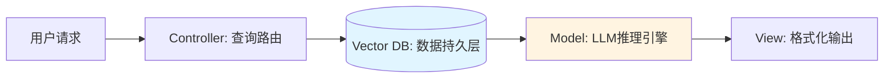
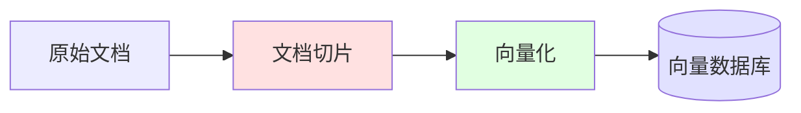
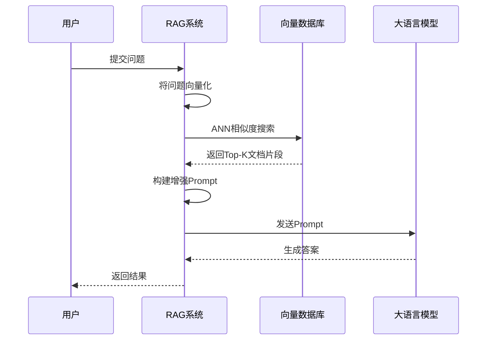
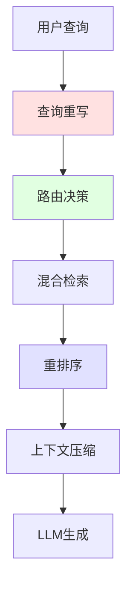

# RAG：检索增强生成

## 问题场景：LLM的知识盲区

LLM面临两个结构性缺陷：

1. **知识截止日期**：训练数据存在时间边界。模型无法感知最新的API文档、今天的股价、昨天的新闻。
2. **私有数据盲点**：模型从未见过企业内部的代码库、设计文档、运维日志。

这两个问题导致实际应用中频繁出现"一本正经地胡说八道"（幻觉）。让模型解释公司内部的微服务架构，它会基于统计规律虚构出看似合理的答案。

**RAG（Retrieval-Augmented Generation）** 通过在推理前动态注入外部知识，将"闭卷考试"转换为"开卷考试"。

## 架构类比：MVC中的数据持久层

对于熟悉Web开发的工程师，RAG的工作流可以映射到经典的MVC模式：



**传统MVC流程**：
1. Controller接收HTTP请求
2. 查询MySQL获取数据
3. Model处理业务逻辑
4. View渲染模板并返回HTML

**RAG流程**：
1. 解析用户问题（Query）
2. 在向量数据库中检索相关文档
3. 将文档与问题拼接，发送给LLM
4. LLM基于检索内容生成答案

关键区别在于：传统数据库执行精确匹配（WHERE id=123），而向量数据库执行语义相似度搜索（寻找在高维空间中距离最近的向量）。

## 核心流水线：从文档到答案

RAG系统的生命周期分为两个阶段：**索引构建（Indexing）** 和 **检索生成（Retrieval & Generation）**。

### 阶段一：索引构建

将原始文档转换为可检索的向量表示。



**步骤1：文档切片（Chunking）**

LLM的上下文窗口有限，且长文本会导致语义模糊。需要将文档拆分为独立的语义单元。

常见策略：
- **固定长度切片**：每512个Token切一次，简单但可能破坏语义完整性
- **语义边界切片**：按段落、章节标题切分，保留结构信息
- **滑动窗口**：相邻片段保留重叠区域，避免信息断裂

```python
# 伪代码示例
def chunk_document(doc: str, size: int = 512, overlap: int = 50):
    tokens = tokenize(doc)
    chunks = []
    for i in range(0, len(tokens), size - overlap):
        chunk = tokens[i:i+size]
        chunks.append(chunk)
    return chunks
```

**步骤2：向量化（Embedding）**

调用专门的Embedding模型（如OpenAI的`text-embedding-3`或开源的`bge-large`），将文本转换为高维向量。

```python
# API调用示例
chunk_text = "RAG通过检索外部知识增强LLM的生成能力"
vector = embedding_model.encode(chunk_text)
# 输出: [0.023, -0.145, 0.891, ..., 0.334]  # 1536维向量
```

这些向量捕获了文本的语义特征。"语义相似"的文本在向量空间中距离较近，即使它们使用不同的词汇。

**步骤3：存储到向量数据库**

将向量及其关联的元数据（原始文本、来源、时间戳）存入向量数据库。常用系统包括：

| 数据库 | 特点 | 适用场景 |
|--------|------|---------|
| Pinecone | 全托管，低延迟 | 生产环境快速部署 |
| Milvus | 开源，高性能 | 大规模私有化部署 |
| pgvector | PostgreSQL扩展 | 与现有PG栈集成 |
| Chroma | 轻量级，内存型 | 原型开发与测试 |

### 阶段二：检索与生成

用户提问时的实时流程。



**步骤1：查询向量化**

用户的问题同样需要转换为向量，使用与索引阶段相同的Embedding模型。

```python
query = "如何优化RAG系统的检索精度？"
query_vector = embedding_model.encode(query)
```

**步骤2：相似度检索**

在向量数据库中执行ANN（Approximate Nearest Neighbor）搜索，找到Top-K个最相似的文档片段。

```python
results = vector_db.search(
    vector=query_vector,
    top_k=3,  # 返回最相关的3个片段
    threshold=0.7  # 相似度阈值
)
```

**步骤3：Prompt增强**

将检索到的文档拼接到用户问题中，构建增强Prompt。

```python
augmented_prompt = f"""
基于以下参考资料回答问题：

---
【资料1】{results[0].text}
【资料2】{results[1].text}
【资料3】{results[2].text}
---

用户问题：{query}

要求：
1. 答案必须基于上述资料
2. 如果资料不足以回答，明确说明
3. 引用资料时标注来源编号
"""
```

**步骤4：LLM生成答案**

将增强后的Prompt发送给LLM，模型基于注入的事实信息生成答案。

::: tip 工程价值
RAG将"知识更新"与"模型训练"解耦。更新知识库只需重新索引文档，无需重新训练模型。这使得知识迭代的成本从千万美元降至千美元级别。
:::

## 从朴素到工程化：RAG架构演进

### 朴素RAG的局限

初代RAG系统采用线性流水线：切片 → 向量化 → 检索 → 生成。这种架构存在三个痛点：

1. **召回率低**：仅依赖语义相似度，可能遗漏相关文档
2. **噪声干扰**：Top-K结果中可能包含无关内容
3. **上下文冗余**：长文档片段占用大量Token，但有效信息稀疏

### 模块化RAG的工程优化

生产级RAG系统引入多个优化模块：



**查询重写（Query Rewriting）**

将用户的口语化问题转换为更适合检索的形式。

```
原始: "这个bug咋修？"
重写: "如何定位并修复该问题？请提供调试步骤和可能的解决方案。"
```

**混合检索（Hybrid Retrieval）**

结合向量检索（语义相似度）和关键词检索（BM25算法），提高召回率。

```python
vector_results = vector_search(query_vector, top_k=10)
keyword_results = bm25_search(query_keywords, top_k=10)
combined_results = merge_and_deduplicate(vector_results, keyword_results)
```

**重排序（Re-ranking）**

使用专门的排序模型对检索结果重新打分，将最相关的文档排在前面。

```python
# 使用Cross-Encoder模型计算query与每个文档的相关性分数
scores = reranker.predict([(query, doc) for doc in combined_results])
final_results = sort_by_score(combined_results, scores)[:3]
```

**上下文压缩（Context Compression）**

在保留关键信息的前提下，压缩文档长度，节省Token成本。

```python
# 提取与问题最相关的句子
compressed = extract_relevant_sentences(
    document=final_results[0],
    query=query,
    max_sentences=5
)
```

## 特殊架构：缓存增强生成（CAG）

对于知识相对静态的场景（如产品FAQ、API文档），可以采用CAG模式：

1. 预先将所有知识加载到LLM的KV缓存中
2. 运行时直接推理，无需检索

**优势**：
- 消除检索延迟
- 保证知识的完整性和一致性

**限制**：
- 只适用于知识量小于上下文窗口的场景
- 无法动态更新知识

## 生产环境的工程挑战

### 数据质量问题

**问题**：文档包含大量HTML标签、格式噪声、重复内容
**解决**：构建文档清洗流水线，标准化文本格式

```python
def clean_document(raw_text: str) -> str:
    # 移除HTML标签
    text = strip_html(raw_text)
    # 规范化空白字符
    text = normalize_whitespace(text)
    # 移除页眉页脚
    text = remove_headers_footers(text)
    return text
```

### 检索精度优化

**问题**：用户问"如何配置Redis集群"，却检索到"MongoDB集群配置"
**解决**：引入元数据过滤，限制检索范围

```python
results = vector_db.search(
    vector=query_vector,
    filter={"category": "redis", "version": ">=7.0"},
    top_k=3
)
```

### 成本控制

**问题**：每次请求检索大量文档，Token成本激增
**解决**：实现智能路由，简单问题直接用LLM回答，复杂问题才启动RAG

```python
if is_simple_question(query):
    return llm.predict(query)  # 不调用RAG
else:
    return rag_pipeline.run(query)  # 完整RAG流程
```

## 架构定位

RAG在AI工程栈中扮演"持久化层"角色，解决LLM的知识边界问题。它与其他组件的关系：

- **LLM**：RAG为其提供事实依据，降低幻觉风险
- **Agent**：Agent可以将RAG作为一个工具调用，按需检索知识
- **MCP**：通过MCP协议，Agent可以连接到多个RAG数据源

典型架构模式：

```
用户查询 → Agent决策 → [是否需要RAG?] 
           ↓ 是
         RAG检索 → 注入上下文 → LLM生成 → 返回结果
```

将RAG视为分布式系统中的缓存层：它在LLM与原始数据之间提供了一个高效的索引和检索机制，使得AI应用能够快速访问海量的外部知识。
